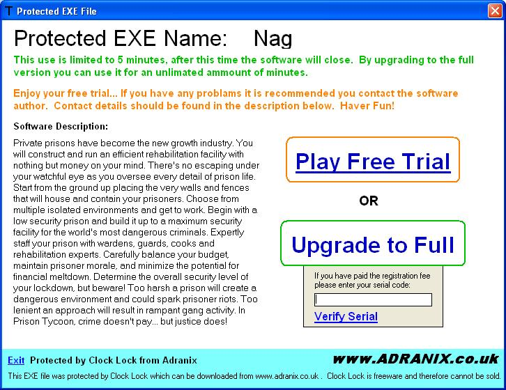



## Wrap EXE Files for X Minute Trial

### Description

With this program you can select a standard .exe file and turn it into a trial protected on without changeing any source code. You can select the number of minutes your user can run the program for while in trial mode and you can also change the serial number that will unlock the program, you can also enter a message to display on trial screen. WARNING - IMPORTANT INFOMATION ON HOW TO RUN THE PROGRAM INCLUDED IN READ ME FILE - IT IS VERY IMPORTANT YOU READ THIS.

I payed someone on Rent-A-Code $50 to made me this so I hope you like it. Please vote and Leave comments. Thanks. (Screenshot to come soon)
 
### More Info
 

             |
---                |---
**Submitted On**   |2005-07-24 12:57:24
**By**             |[Adam Ranshaw](https://github.com/Planet-Source-Code/PSCIndex/blob/master/ByAuthor/adam-ranshaw.md)
**Level**          |Intermediate
**User Rating**    |4.3 (17 globes from 4 users)
**Compatibility**  |VB 5\.0, VB 6\.0
**Category**       |[Registry](https://github.com/Planet-Source-Code/PSCIndex/blob/master/ByCategory/registry__1-36.md)
**World**          |[Visual Basic](https://github.com/Planet-Source-Code/PSCIndex/blob/master/ByWorld/visual-basic.md)
**Archive File**   |[Securly\_Wr1916847242005\.zip](https://github.com/Planet-Source-Code/adam-ranshaw-wrap-exe-files-for-x-minute-trial__1-61876/archive/master.zip)

